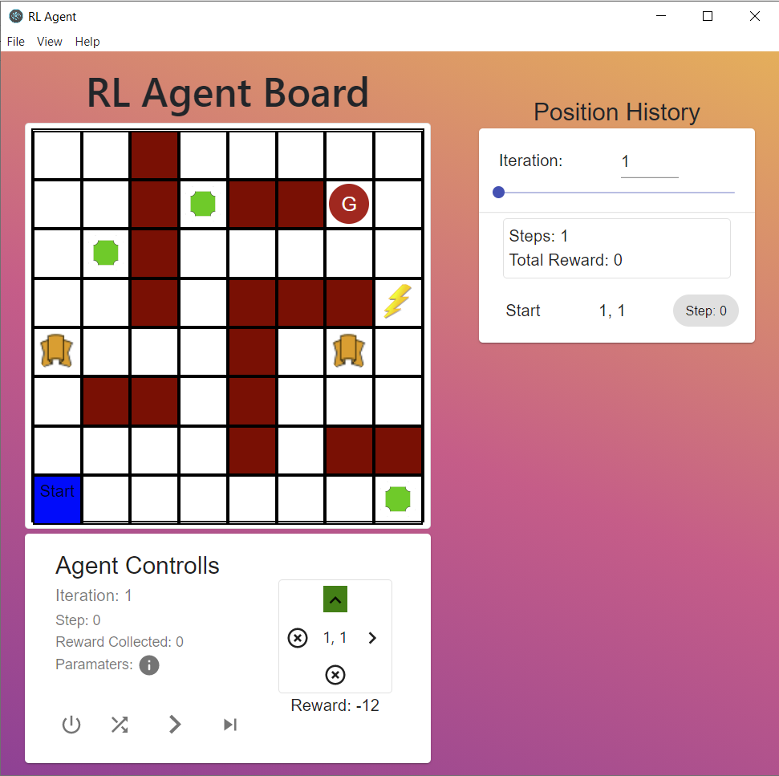

# AI2 - Assignment 2

> See [Report.pdf](./Report.pdf) and [Video demonstration](https://youtu.be/wqlIKnwHkww)
> 

  

## Question

Make an 8x8 grid agent world as shown below.

### The Environment: AGENT WORLD

There are 5 components to take a note of,

1. Go to `Power Position` : On Reaching here, agent will start its next move
   from “`Power Position`” as shown.
2. `Goal` : The location of the goal should be randomly selected from the range.
   `(x>5, y>5)` eg. `(6,6)`, `(8,8)`, `(8,6)` etc., everytime the code is run, the goal should change.
3. `Restart`: The Agent will need to go restart and go to position `(1,1)`
4. Brown Blocks : `Walls` (Agent isn't allowed to penetrate through these positions)
5. `Start`: Agent will be starting from `(1,1)` everytime the game is started.

### Details

This assignment is aimed to motivate students to design a reinforcement learning based model by thinking on policies, goals, knowledge base, environment and reward function etc.

You are required to build a reinforcement learning game for the agent and
environment as shown above. The position of the goal must be kept in the suggested region and the position of the walls and other entities must be kept unchanged strictly.

You may refer to some searching algorithms to reach the goal to design the policies and further reward functions, path followed, path cost etc. For example, Simulated Annealing, Local Search, A\* Search etc.

### To Do

1. Knowledge Base Creation: How (in what format) the information of the
   visited nodes are stored in the agents memory. Print the knowledge base with every iteration.
2. Policy Design: What set of rules are considered to design the agents
   behavior/ interaction in the environment.
3. Reward Function Design: Design a reward function that will help the
   agent to reach the goal as early as possible. Note: You can take inference
   from the Romania Map diagram in the book Peter Norvig-Russel. (A\* search Section)
4. Path Cost: Print the total Path cost for the path followed by the agent.
   (Optimal path cost must be there in the end, as with more iterations, the
   agent will interact more with the environment and thus learn more which leads to more knowledge in the Knowledge base.
5. Path Followed: Print the path followed for every iteration and the most
   optimal path.

## Running the porgram

### Release

You can find a windows release on the [Releases page](https://github.com/jaideepheer/AI2-Assignment_2-ReactElectron_QLearning_Agent/releases/latest). Simply download the `.exe` file and run it.

### Development

The program is implemented as a web app using React and Electron. To run it in a development environment,

- Make sure [nodejs](https://nodejs.org/en/) is installed.
- Clone this repository.
- Run: `npm install`
- Run: `npm start`

> If you want to craete an executable yourself you can run the following after running the above commands,
>
> - `npm run build`
> - `npm run package`

## Implementation

The software designed contains a Q-Learning agent which navigates in a maze in order to reach the goal position. The Q-Learning algorithm followed is as follows,

| Implementation for this in [QLearningAgent.ts](./src/game_core/QLearningAgent.ts#L154) |
| :------------------------------------------------------------------------------------: |
|                                                             |

### Negative Reward

The reward for each position is calculated as follows,

> `reward(pos) = -1 * ManhattanDistance(pos, goal)`

By keeping the reward -ve, we can encourage the agent to find the shortest path to reach to the goal node instead of roaming around in the environment.

### Output

The program looks as follows,

### Features

| Feature                                                                                                                                                                                                                                                                                                                                                            | 
Image
 |
| :----------------------------------------------------------------------------------------------------------------------------------------------------------------------------------------------------------------------------------------------------------------------------------------------------------------------------------------------------------------- | :----------------------------------: |
| 
At every position the agent has at most 4 actions available (UP, DOWN, LEFT, RIGHT). The application highlights the recommended action in green. The agent selects the recommended action according to the equation for ‘a’ in the above algorithm.
                                                                         |           |
| 
The agent also uses an exploration function to deviate from the usual route in order to find new potentially better routes. The exploration function is proportional to frequency of a state-action pair since the reward is -ve and the agent gets more penalized for taking the same route multiple times.
                |           |
| 
The knowledgebase consists of the Q-Values and Frequencies of every state-action pair explored by the agent. The application shows this on hovering over the possible actions for this state and also while hovering over the path histories. The exploration value here is the value returned by the exploration function.
 |           |
| 
The position history column shows the entire path taken by the agent for every iteration. It lists the position of the agent for each step and also shows the total reward collected by the agent in that iteration along with the number of steps taken to reach the goal position.
                                        |           |
| 
The application allows users to control the agent step-by-step or iteration-by-iteration. A button to randomly reposition the goal is also available and a button to reset everything is present.
                                                                                                                           |           |
